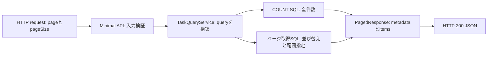

# EF Coreでページング結果を永続DBから取得する

## 今回の課題

- 目安時間: 35〜45分
- 前提: `DbContext`、migration、LINQの遅延実行、ページング計算を説明できる
- 目的: HTTPのページング契約を変えず、固定`List`をEF Core + SQLiteへ置き換えた処理経路を説明できる

前回は、ページングというHTTP契約と計算へ集中するため、`Program.cs`に置いた5件の固定dataを使いました。今回は同じ`GET /tasks?page=...&pageSize=...`の裏側をSQLiteへ置き換えます。clientが送るquery parameterと受け取るJSONは変わりません。変わるのは、taskの生存期間がapplication process内の`List`からdatabase fileへ移り、一覧取得がdatabase I/Oを伴う非同期処理になる点です。

application起動時には、connection stringを設定から読み、`TaskDbContext`と`TaskQueryService`をDI containerへ登録します。この時点ではtask一覧を取得しません。requestが来るとASP.NET Coreがrequest scopeを作り、そのscope用の`TaskDbContext`とserviceを生成します。serviceがLINQ queryを組み立て、`CountAsync`と`ToListAsync`でSQLiteへ二つのSQLを送ります。responseを返してrequest scopeが終わると、DI containerが`TaskDbContext`を破棄します。database file内のdataはrequest終了後も残ります。



この図で重要なのは、全件数と現在pageの要素が別の目的を持つことです。`TotalCount`にはページング前の件数が必要ですが、`Items`には指定範囲だけが必要です。そのため今回は2 queryになります。

## Java / Springとの比較

`TaskDbContext`は、JPAの`EntityManager`とrepositoryが担う責務を一部まとめた存在として読むと近いです。`DbSet<TaskItem>`がqueryの起点となり、LINQ expressionをSQLite向けSQLへ翻訳します。ASP.NET Coreでは`AddDbContext`によるscoped登録が一般的で、HTTP requestごとにcontextが作られます。

Spring Data JPAで`Pageable`と`Page<T>`を使うと、page内容と全件数をframeworkがまとめて扱う場合があります。今回のC#実装では、`CountAsync`、`Skip`、`Take`、`PagedResponse<T>`を明示しているため、どのSQLが必要で、どのmetadataを返すのかをコードから直接追跡できます。

## 新しく読むC# / .NETの形

### `async Task<IResult>`のendpoint

```csharp
app.MapGet("/tasks", async Task<IResult> (
    TaskQueryService taskQueryService,
    CancellationToken cancellationToken,
    int page = 1,
    int pageSize = 20) =>
```

固定`List`の操作は同期処理でしたが、database I/O中にthreadを占有しないようendpointを非同期化しました。`Task<IResult>`は「将来`IResult`が完了する非同期処理」を表します。ASP.NET CoreはserviceをDIから、`CancellationToken`をrequestの中断通知から、`page`と`pageSize`をquery stringから渡します。

### `DbSet<TaskItem>`

```csharp
public DbSet<TaskItem> Tasks => Set<TaskItem>();
```

`DbSet<TaskItem>`はmemory上の`List<TaskItem>`ではなく、`Tasks` tableに対するqueryと変更の入口です。ここから始まるLINQはexpression treeとして蓄積され、`CountAsync`や`ToListAsync`でSQLとして実行されます。

### `AsNoTracking`

```csharp
var query = dbContext.Tasks.AsNoTracking();
```

この一覧はentityを更新しないため、change trackerへ登録しません。response用の`TaskSummary`へprojectionして読み取るだけなので、追跡の費用を省けます。

## 変更対象ファイル

| ファイル | 変更内容 |
| --- | --- |
| `05-capstone/flake.nix` | native SQLiteを.NET processから発見するため`LD_LIBRARY_PATH`を追加 |
| `05-capstone/.config/dotnet-tools.json` | migration生成用`dotnet-ef`を固定 |
| `05-capstone/TaskManagementApi/TaskManagementApi.csproj` | EF Core SQLite・Design packageを追加 |
| `05-capstone/TaskManagementApi/appsettings.json` | production用SQLite connection stringを追加 |
| `05-capstone/TaskManagementApi/Models/TaskItem.cs` | databaseへ保存するentityを追加 |
| `05-capstone/TaskManagementApi/Data/TaskDbContext.cs` | `Tasks` tableとtitle最大長を定義 |
| `05-capstone/TaskManagementApi/Services/TaskQueryService.cs` | 全件数とpage要素を非同期取得するserviceを追加 |
| `05-capstone/TaskManagementApi/Program.cs` | DbContext・service登録と非同期endpointへ変更 |
| `05-capstone/TaskManagementApi/Data/Migrations/20260813074927_InitialCreate.cs` | `Tasks` tableを作るmigrationを追加 |
| `05-capstone/TaskManagementApi/Data/Migrations/20260813074927_InitialCreate.Designer.cs` | migration生成時model metadataを追加 |
| `05-capstone/TaskManagementApi/Data/Migrations/TaskDbContextModelSnapshot.cs` | 最新EF Core model snapshotを追加 |
| `05-capstone/TaskManagementApi.Tests/TaskManagementApiFactory.cs` | production DB登録をtest用SQLiteへ差し替えるfactoryを追加 |
| `05-capstone/TaskManagementApi.Tests/TaskPaginationTests.cs` | 各test前にschemaと5件のdataを準備するよう変更 |
| `05-capstone/docs/02-ef-core-persistence.md` | この課題説明を追加 |
| `05-capstone/docs/02-ef-core-persistence-answers.md` | 回答シートを追加 |

## 実装コード

### `05-capstone/TaskManagementApi/Data/TaskDbContext.cs`

```csharp
public sealed class TaskDbContext(DbContextOptions<TaskDbContext> options)
    : DbContext(options)
{
    public DbSet<TaskItem> Tasks => Set<TaskItem>();

    protected override void OnModelCreating(ModelBuilder modelBuilder)
    {
        modelBuilder.Entity<TaskItem>(entity =>
        {
            entity.Property(task => task.Title)
                .HasMaxLength(100);
        });
    }
}
```

DI containerがconnection設定を含む`DbContextOptions`を渡します。model定義では`Title`を最大100文字とし、migrationでは`TEXT NOT NULL`と最大長metadataへ変換されます。

### `05-capstone/TaskManagementApi/Services/TaskQueryService.cs`

```csharp
public async Task<PagedResponse<TaskSummary>> GetTasksAsync(
    int page,
    int pageSize,
    CancellationToken cancellationToken)
{
    var query = dbContext.Tasks.AsNoTracking();
    var totalCount = await query.CountAsync(cancellationToken);

    var items = await query
        .OrderBy(task => task.Id)
        .Skip((page - 1) * pageSize)
        .Take(pageSize)
        .Select(task => new TaskSummary(
            task.Id,
            task.Title,
            task.IsCompleted))
        .ToListAsync(cancellationToken);

    return new PagedResponse<TaskSummary>(
        items,
        page,
        pageSize,
        totalCount);
}
```

`CountAsync`でfilter・page適用前の全件数を取得します。その後、安定したID順を作り、database側で必要範囲だけを選び、response modelへprojectionします。二つのterminal operationへ同じcancellation tokenを渡すため、client切断時には実行中のdatabase処理にも停止要求を伝播できます。

### `05-capstone/TaskManagementApi/Program.cs`

```csharp
builder.Services.AddDbContext<TaskDbContext>(options =>
    options.UseSqlite(connectionString));
builder.Services.AddScoped<TaskQueryService>();
```

これはapplication起動時の登録です。runtimeにはrequest scopeごとに`TaskDbContext`と`TaskQueryService`が生成されます。serviceもcontextもscopedなので、一つのrequest内で同じcontextを共有し、request終了時にcontainerが破棄します。

### `05-capstone/TaskManagementApi.Tests/TaskManagementApiFactory.cs`

```csharp
services.RemoveAll<DbContextOptions<TaskDbContext>>();
services.AddDbContext<TaskDbContext>(options =>
    options.UseSqlite(connection));
```

testではproductionの`tasks.db`を触らず、factoryが所有するインメモリSQLiteへ登録を置換します。各testの`ResetDatabaseAsync`がschemaを作り直して同じ5件を保存するため、test順序や以前の実行結果に依存しません。request scopeのcontextが破棄されても、factory所有connectionが開いている間はtest databaseが残ります。

## migration

`InitialCreate`の`Up`は、`Id`、`Title`、`IsCompleted`を持つ`Tasks` tableを作ります。`Down`はtableを削除します。productionでdatabaseへ反映するcommandは次です。

```fish
cd /home/yukihiro/Workspace/c#-learning/05-capstone
dotnet tool restore
dotnet ef database update --project TaskManagementApi/TaskManagementApi.csproj
```

今回はmigration fileの生成と統合テスト用schemaの検証まで行い、repository内にlocal database fileはcommitしません。

## 検証方法と結果

```fish
cd /home/yukihiro/Workspace/c#-learning/05-capstone
nix develop -c dotnet format TaskManagementApi.slnx --verify-no-changes
nix develop -c dotnet test TaskManagementApi.slnx -m:1 --no-restore
```

production projectとtest projectはbuildに成功し、ページング統合テストは`Passed: 3, Failed: 0, Skipped: 0`でした。テストはHTTP pipeline、DI、service、EF CoreのSQL変換、SQLite、JSON responseを通っています。

## コードリーディング課題

1. 一回の正常な一覧requestで、serviceがSQLiteへ二つのqueryを送るのはなぜですか。それぞれ何を取得しますか。
2. production用`TaskDbContext`をtestでそのまま使わず、`TaskManagementApiFactory`が登録を差し替える理由を説明してください。
3. `CountAsync`と`ToListAsync`の両方へ同じ`CancellationToken`を渡す理由を説明してください。

## 完了条件

- 固定`List`からSQLiteへ変わってもHTTP契約が変わらないことを説明できる
- 全件数queryとpage取得queryの目的を区別できる
- productionのfile DBとtestのインメモリDBを分離する理由を説明できる
- cancellationがdatabase I/Oまで伝播する経路を説明できる
- ページング統合テスト3件が成功する
