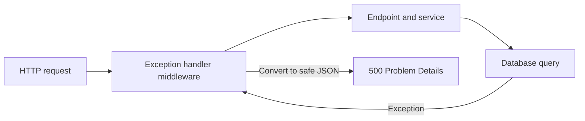

# 未処理例外をProblem Detailsへ変換する

## 今回の課題

- 目安時間: 30〜40分
- 前提: ASP.NET Coreのmiddleware pipelineとHTTP status 500の意味を説明できる
- 目的: application内部の未処理例外を、内部情報を漏らさない一貫したProblem Details responseへ変換する流れを説明できる

Codexがglobal exception handlingを追加しました。

endpointやservice、database処理から未処理例外が上がってきた場合、connection errorやstack traceをそのままclientへ返すのではなく、status 500のProblem Details JSONへ変換します。

Problem Detailsは、HTTP APIのerrorを共通のJSON構造で表すための標準形式です。

代表的なmemberは`type`、`title`、`status`、`detail`、`instance`です。

すべてを毎回返す必要はありません。

今回の500 responseは、errorの種類を示す`type`、概要を示す`title`、HTTP statusと同じ`status`、server側の記録と照合する`traceId`を返します。

今回の対象は、title validationの失敗やresource不存在ではありません。

これらはapplicationが予想して分岐できる400や404です。

対象は、database接続失敗など、通常処理を継続できず未処理例外になった内部障害です。

## setup時とrequest実行時

Problem Details対応には、setup時のservice登録と、request実行時のmiddleware登録の両方が必要です。

application起動時に`AddProblemDetails`を呼ぶと、Problem Details responseを書き出すserviceがDI containerへ登録されます。

ここではresponseはまだ作られません。
さらに`CustomizeProblemDetails`を設定し、すべてのProblem Detailsへ現在のrequestの`traceId`を追加する規則を登録します。

`builder.Build()`後に`UseExceptionHandler`を呼ぶと、例外処理middlewareがrequest pipelineへ追加されます。
runtimeでは、このmiddlewareが後続のendpointやserviceを呼び出します。
後続処理が正常終了すれば、そのresponseをそのまま通します。
未処理例外がmiddlewareまで戻ってきた場合は、例外を捕捉してstatus 500を設定し、登録済みのProblem Details serviceを使ってJSON responseを書き出します。

つまり、`AddProblemDetails`は「Problem Detailsをどう書くかの準備」、`UseExceptionHandler`は「後続処理の例外をruntimeに捕捉する入口」です。
片方だけでは今回の一連の動作になりません。



## middlewareをendpointより前に登録する理由

middlewareは登録順に後続処理を包みます。
`UseExceptionHandler`をendpoint mappingより前に置くことで、endpoint、service、EF Coreを含む後続処理から上がる例外を捕捉できます。

例外処理middlewareが対象処理の外側にいなければ、その例外はmiddlewareへ戻りません。
今回のコードでは`UseExceptionHandler`の後にすべての`MapDelete`、`MapPut`、`MapPost`、`MapGet`が続くため、API処理全体が捕捉範囲に入ります。

## clientへ返す情報とserverに残す情報

database driverの例外名、SQL、connection string、stack traceなどは、clientがrequestを直して解決できる情報ではありません。
また、内部構造や秘密情報を推測する材料になる可能性があります。
そのため今回のresponse bodyには含めません。

一方で、clientから「このrequestが500になった」と問い合わせを受けたとき、server側のlogと対応付ける識別子は役立ちます。
そこで`HttpContext.TraceIdentifier`を`traceId`としてresponseへ追加します。
運用では同じtrace IDをserver logにも含めることで、clientへ内部例外を見せずに該当logを探せます。

responseは概ね次の形です。
`type`と`title`の具体値はframeworkがstatus 500に応じて設定します。

```json
{
  "type": "500の意味を説明するURI",
  "title": "request処理中にerrorが発生したことを示す概要",
  "status": 500,
  "traceId": "requestを識別する値"
}
```

`SqliteException`、SQL、stack traceは含まれません。

## Java / Springとの比較

Spring Bootで`@RestControllerAdvice`と`@ExceptionHandler`を使い、未処理例外を共通error responseへ変換する構成に近いです。
ASP.NET Coreでは、application全体を包むexception handling middlewareとProblem Details writerを組み合わせます。

Spring側でも、内部例外のmessageやstack traceをclientへ返さず、server logに記録した識別子だけをresponseへ含める考え方は同じです。
frameworkの仕組みは異なりますが、「例外の詳細はserver側、clientには安定した契約」という境界は共通しています。

## 新しく読むAPIと構文

### `AddProblemDetails`

```csharp
builder.Services.AddProblemDetails(options =>
{
    options.CustomizeProblemDetails = context =>
    {
        context.ProblemDetails.Extensions["traceId"] =
            context.HttpContext.TraceIdentifier;
    };
});
```

Problem Detailsを書き出すserviceをDIへ登録します。
`Extensions`は標準member以外の追加情報を格納するdictionaryです。
今回は`traceId`というkeyでrequest識別子を追加します。
このlambdaはapplication起動時にresponseを作るのではなく、Problem Detailsを書き出すrequestごとに呼ばれます。

### `UseExceptionHandler`

```csharp
app.UseExceptionHandler();
```

後続処理の未処理例外を捕捉するmiddlewareをpipelineへ登録します。
引数なしで使う場合、登録済みのProblem Details serviceが500 responseの生成に使われます。

### `ProblemDetails`

```csharp
var problem = await response.Content
    .ReadFromJsonAsync<ProblemDetails>();
```

統合テストではJSON responseをASP.NET Coreの`ProblemDetails`型へdeserializeします。
`Status`、`Title`、`Type`などを文字列検索ではなくpropertyとして検証できます。
独自の`traceId`は`Extensions` dictionaryに入ります。

## 変更対象ファイル

| ファイル | 変更内容 |
| --- | --- |
| `05-capstone/TaskManagementApi/Program.cs` | Problem Details service、trace ID追加規則、exception handling middlewareを登録 |
| `05-capstone/TaskManagementApi.Tests/ProblemDetailsTests.cs` | database例外が安全な500 Problem Detailsへ変換される統合テストを追加 |
| `05-capstone/docs/07-problem-details.md` | この課題説明を追加 |
| `05-capstone/docs/07-problem-details-answers.md` | 回答シートを追加 |

理解確認前なので、rootの`README.md`はまだ変更しません。

## 実装コード

### `05-capstone/TaskManagementApi/Program.cs`

```csharp
builder.Services.AddProblemDetails(options =>
{
    options.CustomizeProblemDetails = context =>
    {
        context.ProblemDetails.Extensions["traceId"] =
            context.HttpContext.TraceIdentifier;
    };
});

var app = builder.Build();

app.UseExceptionHandler();
```

`AddProblemDetails`は`Build`前のservice登録です。
`UseExceptionHandler`は`Build`後のpipeline登録です。
その後にendpointをmapしているため、runtimeではexception handlerの内側でendpoint処理が動きます。

### `05-capstone/TaskManagementApi.Tests/ProblemDetailsTests.cs`

```csharp
services.RemoveAll<DbContextOptions<TaskDbContext>>();
services.AddDbContext<TaskDbContext>(options =>
    options.UseSqlite("Data Source=:memory:"));
```

このtest専用applicationでは、通常のtest database登録を、schemaを作成していないin-memory SQLiteへ置き換えます。
`GET /tasks`が存在しないtableをqueryするため、EF Coreからdatabase例外が発生します。
application codeへtest専用の例外endpointを追加せず、現実に起こり得るdatabase障害を再現しています。

```csharp
Assert.Equal(HttpStatusCode.InternalServerError, response.StatusCode);
Assert.Equal(
    "application/problem+json",
    response.Content.Headers.ContentType?.MediaType);

var problem = await response.Content.ReadFromJsonAsync<ProblemDetails>();
Assert.NotNull(problem);
Assert.Equal(500, problem.Status);
Assert.False(string.IsNullOrWhiteSpace(problem.Title));
Assert.False(string.IsNullOrWhiteSpace(problem.Type));
Assert.True(problem.Extensions.ContainsKey("traceId"));
```

この部分はstatus 500、Problem Details用media type、標準member、独自`traceId`を確認します。

```csharp
var responseBody = await response.Content.ReadAsStringAsync();
Assert.DoesNotContain("SqliteException", responseBody);
Assert.DoesNotContain("StackTrace", responseBody);
```

最後に、database driverの例外型とstack traceがclient responseへ漏れていないことを確認します。
serverでの例外log出力は別の構造化logging課題で扱います。

## 検証方法と結果

```fish
cd /home/yukihiro/Workspace/c#-learning/05-capstone
nix develop -c dotnet format TaskManagementApi.slnx --verify-no-changes --no-restore
nix develop -c dotnet test TaskManagementApi.slnx -m:1 --no-restore
```

既存test 14件とProblem Details test 1件を合わせ、`Passed: 15, Failed: 0, Skipped: 0`でした。

## コードリーディング課題

1. `AddProblemDetails`と`UseExceptionHandler`は、それぞれapplication起動時とrequest実行時にどのような役割を持ちますか。
2. `UseExceptionHandler`をendpoint mappingより前に登録しているのは、どの範囲の例外を捕捉するためですか。
3. 500 responseへ`SqliteException`やstack traceを含めず、代わりに`traceId`を含めるのはなぜですか。

## 設問と教材の対応確認

| 設問 | 回答に必要な説明 |
| --- | --- |
| 問1 | 「setup時とrequest実行時」と`Program.cs`のservice登録・middleware登録の説明 |
| 問2 | 「middlewareをendpointより前に登録する理由」の捕捉範囲の説明 |
| 問3 | 「clientへ返す情報とserverに残す情報」の内部情報非公開とlog照合の説明 |

## 完了条件

- Problem DetailsがHTTP API errorの共通JSON形式であることを説明できる
- `AddProblemDetails`と`UseExceptionHandler`の役割を区別できる
- exception handlerをendpointより前に登録する理由を説明できる
- 内部例外の詳細をclientへ返さない理由を説明できる
- `traceId`をserver logとの照合に使う目的を説明できる
- database例外が500 Problem Detailsへ変換され、全15件のtestが成功する
