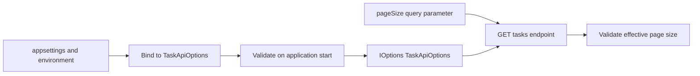

# ページング設定をOptionsパターンで検証する

## 今回の課題

- 目安時間: 30〜40分
- 前提: `appsettings.json`、DI、Optionsパターンの基本を説明できる
- 目的: ページングの既定値と上限を外部設定から型安全に受け取り、設定ミスをapplication起動時に検出する流れを説明できる

Codexが、一覧APIへ直接書かれていたpage sizeの既定値`20`と上限`100`を`appsettings.json`へ移しました。
設定値は`TaskApiOptions`へbindし、application起動時にvalidationします。
endpointはquery parameterが省略された場合に設定上の既定値を使い、指定された場合はその値を設定上の上限と比較します。

この変更の目的は、数値をJSONへ移すことだけではありません。
文字列keyで設定を何度も読む代わりに、C#の型として扱えること、設定同士の不整合をtraffic受付前に検出できること、endpointが設定sourceの詳細を知らずに済むことがOptionsパターンの中心です。

## 設定sourceからendpointまで

`appsettings.json`には次のsectionを追加しました。

```json
"TaskApi": {
  "DefaultPageSize": 20,
  "MaxPageSize": 100
}
```

applicationのsetup時に、`TaskApi` sectionを`TaskApiOptions`へbindします。
bindingでは`DefaultPageSize`と`MaxPageSize`という設定keyが、同名のC# propertyへ変換されます。

bind後に3つの規則を検証します。

- `DefaultPageSize`は1以上
- `MaxPageSize`は1以上500以下
- `DefaultPageSize`は`MaxPageSize`以下

`ValidateOnStart`を付けているため、設定が不正なら最初のAPI requestを処理する前にapplication起動が失敗します。
運用担当者が誤った環境変数やJSONを設定した状態で、一部requestだけが失敗するapplicationを起動させないためです。

runtimeで`GET /tasks`が呼ばれると、DIが`IOptions<TaskApiOptions>`をendpointへ渡します。
query parameterの`pageSize`が省略されていれば`DefaultPageSize`を使い、指定されていればclientの値を使います。
その実効値が1未満または`MaxPageSize`超過なら400 Validation Problemを返します。



## 二種類のvalidation

今回のコードには、対象と実行時点が異なる二種類のvalidationがあります。

| validation | 対象 | 実行時点 | 失敗結果 |
| --- | --- | --- | --- |
| Options validation | operatorが用意したapplication設定 | application起動時 | 起動失敗 |
| query parameter validation | clientがrequestごとに送った値 | request実行時 | 400 response |

例えば`DefaultPageSize=200`、`MaxPageSize=100`という組み合わせは設定自体が矛盾しているため、起動時に拒否します。
一方、正しい設定で起動したapplicationへclientが`pageSize=200`を送った場合は、そのrequestだけを400として拒否します。

設定ミスをclient errorとして扱わず、client入力ミスをapplication起動失敗として扱わないことが重要です。

## なぜproperty単体だけでなく組み合わせも検証するのか

`DefaultPageSize=100`と`MaxPageSize=50`は、どちらも単独では正の整数です。
しかし、query parameter省略時に選ばれる既定値が、API自身の許可する上限を超えています。

このような制約は一つのpropertyだけを見ても判断できません。
そのため、最後の`Validate`で`DefaultPageSize <= MaxPageSize`というproperty間の関係を手続き的に検証します。

## Java / Springとの比較

Spring Bootの`@ConfigurationProperties(prefix = "task-api")`で設定をclassへbindし、Bean Validationや独自validatorで検証する構成に近いです。
ASP.NET Coreでは`AddOptions<T>`、`Bind`、`Validate`、`ValidateOnStart`をchainして同じ境界を作ります。

endpointへ設定system全体を表す`IConfiguration`を渡すのではなく、必要なsectionだけを表す`IOptions<TaskApiOptions>`を渡す点も、型付きの`@ConfigurationProperties` classを注入する考え方と似ています。

## 新しく読む構文とAPI

### Options class

```csharp
public sealed class TaskApiOptions
{
    public const string SectionName = "TaskApi";

    public int DefaultPageSize { get; init; }

    public int MaxPageSize { get; init; }
}
```

`SectionName`に設定section名を一か所だけ定義します。
設定値は`init` propertyへbindされ、application codeは文字列keyではなく`int` propertyとして読みます。

### Options登録とvalidation

```csharp
builder.Services
    .AddOptions<TaskApiOptions>()
    .Bind(builder.Configuration.GetSection(TaskApiOptions.SectionName))
    .Validate(options => options.DefaultPageSize >= 1,
        "TaskApi:DefaultPageSize must be at least 1.")
    .Validate(options => options.MaxPageSize is >= 1 and <= 500,
        "TaskApi:MaxPageSize must be between 1 and 500.")
    .Validate(options => options.DefaultPageSize <= options.MaxPageSize,
        "TaskApi:DefaultPageSize must not exceed TaskApi:MaxPageSize.")
    .ValidateOnStart();
```

`AddOptions<T>`が型付き設定をDIへ登録し、`Bind`がconfiguration sectionとpropertyを対応付けます。
各`Validate` lambdaが`true`なら有効、`false`なら後ろのmessageを持つvalidation failureです。
`is >= 1 and <= 500`は、1以上かつ500以下を表すrelational patternです。
`ValidateOnStart`がvalidationの実行を起動時まで前倒しします。

### query parameterと既定値の選択

```csharp
IOptions<TaskApiOptions> options,
CancellationToken cancellationToken,
int page = 1,
int? pageSize = null
```

`pageSize`を`int?`にしたことで、query parameterの省略を`null`として区別できます。
通常の`int`で既定値を直接指定すると、clientが送らなかったこととframeworkが補った値をendpoint内で区別できません。

```csharp
var settings = options.Value;
var effectivePageSize = pageSize ?? settings.DefaultPageSize;
```

`options.Value`からbind・validation済みの`TaskApiOptions`を取得します。
null coalescing operatorの`??`は、左側がnullでなければ左側を、nullなら右側を返します。
したがって明示的なpage sizeがあればclient値を、省略時だけ設定値を選びます。

## 変更対象ファイル

| ファイル | 変更内容 |
| --- | --- |
| `05-capstone/TaskManagementApi/Options/TaskApiOptions.cs` | ページング設定を表す型を追加 |
| `05-capstone/TaskManagementApi/appsettings.json` | `TaskApi` sectionと既定値・上限を追加 |
| `05-capstone/TaskManagementApi/Program.cs` | Optionsのbind・起動時validation・endpointでの利用を追加 |
| `05-capstone/TaskManagementApi.Tests/TaskApiOptionsTests.cs` | 設定上書きと不正設定による起動失敗を検証 |
| `05-capstone/docs/08-task-api-options.md` | この課題説明を追加 |
| `05-capstone/docs/08-task-api-options-answers.md` | 回答シートを追加 |

理解確認前なので、rootの`README.md`はまだ変更しません。

## 実装コード

### `05-capstone/TaskManagementApi/Options/TaskApiOptions.cs`

```csharp
public sealed class TaskApiOptions
{
    public const string SectionName = "TaskApi";

    public int DefaultPageSize { get; init; }

    public int MaxPageSize { get; init; }
}
```

このclassは設定値だけを保持し、endpoint処理やdatabase処理を持ちません。
設定sourceがJSONでも環境変数でも、binding後のapplication codeは同じ型を読みます。

### `05-capstone/TaskManagementApi/Program.cs`

setup部分は、先ほど示したOptions登録chainを追加しています。
runtimeの一覧endpointは次のように変更しました。

```csharp
app.MapGet("/tasks", async Task<IResult> (
    TaskQueryService taskQueryService,
    IOptions<TaskApiOptions> options,
    CancellationToken cancellationToken,
    int page = 1,
    int? pageSize = null) =>
{
    var settings = options.Value;
    var effectivePageSize = pageSize ?? settings.DefaultPageSize;
    var errors = new Dictionary<string, string[]>();

    if (page < 1)
    {
        errors[nameof(page)] = ["pageは1以上を指定してください。"];
    }

    if (effectivePageSize < 1 || effectivePageSize > settings.MaxPageSize)
    {
        errors[nameof(pageSize)] =
            [$"pageSizeは1以上{settings.MaxPageSize}以下を指定してください。"];
    }

    if (errors.Count > 0)
    {
        return Results.ValidationProblem(errors);
    }

    var result = await taskQueryService.GetTasksAsync(
        page,
        effectivePageSize,
        cancellationToken);

    return Results.Ok(result);
});
```

frameworkがDIとquery parameterをparameterへ渡した後、endpointが実効page sizeを一度だけ決めます。
以後のvalidationとdatabase queryでは同じ`effectivePageSize`を使うため、検証した値と実際に使う値がずれません。

### `05-capstone/TaskManagementApi.Tests/TaskApiOptionsTests.cs`

正常系testはtest applicationのconfigurationへ`DefaultPageSize=2`と`MaxPageSize=3`を追加します。
`GET /tasks`ではpageSizeを送らず、responseの`PageSize`と要素数が2になることを確認します。
これにより、endpointのhard-coded valueではなくbindされた設定値が使われたことを検証します。
さらに`pageSize=4`を送って400になることを確認し、設定した上限3がrequest validationにも使われることを検証します。

異常系testは`DefaultPageSize=4`と`MaxPageSize=3`を設定します。
`configuredFactory.CreateClient`でtest serverを起動した時点で`OptionsValidationException`になることを確認します。
API requestの400や500ではなく、`ValidateOnStart`によりtraffic受付前に起動失敗することを固定しています。

## 検証方法と結果

```fish
cd /home/yukihiro/Workspace/c#-learning/05-capstone
nix develop -c dotnet format TaskManagementApi.slnx --verify-no-changes --no-restore
nix develop -c dotnet test TaskManagementApi.slnx -m:1 --no-restore
```

既存test 15件とOptions test 2件を合わせ、`Passed: 17, Failed: 0, Skipped: 0`でした。

## コードリーディング課題

1. Options validationとquery parameter validationは、それぞれ誰が用意した何の値を、いつ検証し、失敗時にどうなりますか。
2. `DefaultPageSize`と`MaxPageSize`がそれぞれ正の整数でも、`DefaultPageSize <= MaxPageSize`を別途検証する必要があるのはなぜですか。
3. `pageSize`を`int?`で受けて`pageSize ?? settings.DefaultPageSize`とすることで、clientが値を指定した場合と省略した場合はそれぞれどう処理されますか。

## 設問と教材の対応確認

| 設問 | 回答に必要な説明 |
| --- | --- |
| 問1 | 「二種類のvalidation」の対象・実行時点・失敗結果の表と説明 |
| 問2 | 「なぜproperty単体だけでなく組み合わせも検証するのか」の矛盾例 |
| 問3 | 「query parameterと既定値の選択」の`int?`と`??`の説明 |

## 完了条件

- configuration sectionがOptions classへbindされる流れを説明できる
- Options validationとrequest validationの対象・時点・失敗結果を区別できる
- property間の関係をvalidationする理由を説明できる
- query parameter省略時だけ設定上の既定値を使う流れを説明できる
- 不正設定が`ValidateOnStart`により起動時に検出されることを説明できる
- 全17件のtestが成功する
