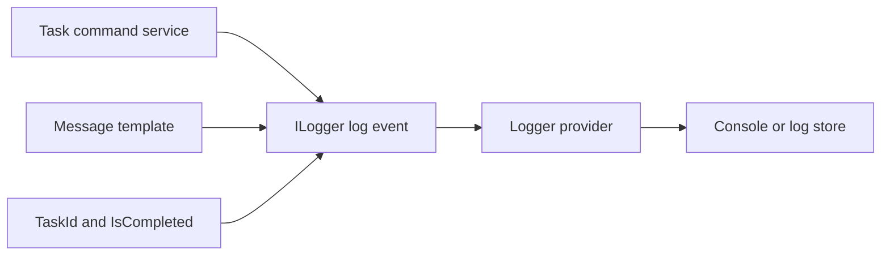

# task操作を構造化logへ記録する

## 今回の課題

- 目安時間: 30〜40分
- 前提: `ILogger<T>`、log level、task作成・更新・削除の保存境界を説明できる
- 目的: task操作の成功を名前付きpropertyとして記録し、文字列表示ではなく構造化dataとして検証できる

Codexがtaskの作成・更新・削除へ構造化logを追加しました。
各操作がdatabaseへ正常に保存された後、`TaskId`や`IsCompleted`を名前付きpropertyとしてInformation levelで記録します。

構造化logでは、完成済み文字列だけをloggerへ渡しません。
固定されたmessage templateと値を別々に渡し、logger providerが一つのlog eventとして扱います。
consoleでは人が読める文章に表示でき、JSON loggerやlog基盤では`TaskId=6`のようなpropertyとして検索・集計できます。

## message templateと構造化property

作成成功logは次のように書いています。

```csharp
logger.LogInformation(
    "Created task {TaskId}",
    task.Id);
```

`"Created task {TaskId}"`はmessage templateです。
`{TaskId}`は単なる表示位置ではなくproperty名になり、後ろの`task.Id`がその値になります。

例えばID 6ならconsoleでは`Created task 6`と表示できます。
同時にlog event内部では、概ね次のdataを保持できます。

```text
Level      = Information
Category   = TaskManagementApi.Services.TaskCommandService
Template   = Created task {TaskId}
TaskId     = 6
```

文字列補間で次のように書くと、loggerへ渡る前に一つの文字列へ変換されます。

```csharp
logger.LogInformation($"Created task {task.Id}");
```

表示は似ていますが、`TaskId`というkeyが失われるため、log基盤でtask IDをfieldとして検索しにくくなります。
構造化logでは、message templateを固定し、変化する値をplaceholderへ渡します。



## database保存後にlogを出す理由

作成処理では、`SaveChangesAsync`が成功するとdatabase採番のIDが`task.Id`へ反映されます。
その後にlogを出すことで、確定したIDを記録できます。

更新と削除も同様に、`SaveChangesAsync`より後で成功logを出します。
もし保存前に`Updated`や`Deleted`を記録すると、その後database処理が失敗した場合でも成功したようなlogが残ります。
調査者はlogとdatabase状態の矛盾に悩むことになります。

今回のlogは「操作を開始した」logではなく「databaseへの反映が成功した」logです。
その意味に合わせて保存完了後へ配置しています。

## 記録するdataを絞る理由

作成・更新時のtitleは自由入力です。
将来、個人情報や秘密情報が入力される可能性があります。
また、長い文字列や種類の多い値はlog量や検索indexを増やします。

今回は操作の対象を識別できる`TaskId`と、更新後の状態を確認する`IsCompleted`だけを記録します。
調査に必要だからといってrequestやentity全体を無条件にlogへ出さず、目的に必要なpropertyだけを選ぶことが重要です。

記録内容は次のとおりです。

| 操作 | template | structured property |
| --- | --- | --- |
| 作成 | `Created task {TaskId}` | `TaskId` |
| 更新 | `Updated task {TaskId}; completion state: {IsCompleted}` | `TaskId`, `IsCompleted` |
| 削除 | `Deleted task {TaskId}` | `TaskId` |

## Java / Springとの比較

SLF4Jで`logger.info("Created task {}", taskId)`と書く形に似ています。
ただし、SLF4Jの通常の`{}`にはproperty名がありません。
MDC、key-value API、またはJSON encoderなどを組み合わせて検索可能なfieldにする設計が必要です。

`ILogger<T>`のmessage templateでは`{TaskId}`の名前がlog stateへ残ります。
対応するproviderが構造化出力を扱えば、その名前をJSON fieldやlog検索keyとして利用できます。

## 新しく読むAPIと構文

### `ILogger<TaskCommandService>`

```csharp
public sealed class TaskCommandService(
    TaskDbContext dbContext,
    ILogger<TaskCommandService> logger)
```

ASP.NET Coreが標準登録しているloggerをDIから受け取ります。
generic argumentの`TaskCommandService`はcategory名になり、どのclassが出したlogかを識別できます。

### 複数propertyを持つtemplate

```csharp
logger.LogInformation(
    "Updated task {TaskId}; completion state: {IsCompleted}",
    task.Id,
    task.IsCompleted);
```

placeholderとargumentは順番に対応します。
このeventでは`TaskId`と`IsCompleted`が別々のpropertyになります。
template内の名前とargumentの意味が一致するように書く必要があります。

### test用`ILoggerProvider`

productionではconsoleなどのproviderがlog eventを受け取ります。
統合テストでは`CollectingLoggerProvider`を追加登録し、同じeventをmemoryへ保存します。

```csharp
services.AddSingleton<ILoggerProvider>(loggerProvider);
```

collectorはloggerへ渡されたstateをkey-valueへ変換します。

```csharp
var properties = values.ToDictionary(
    pair => pair.Key,
    pair => pair.Value);
properties.TryGetValue("{OriginalFormat}", out var template);
properties.Remove("{OriginalFormat}");
```

`{OriginalFormat}`には元のmessage templateが入っています。
残りの`TaskId`などはstructured propertyとして保持します。
このtest providerは今回のevent propertyを検証するためのもので、production log出力は変更しません。

## 変更対象ファイル

| ファイル | 変更内容 |
| --- | --- |
| `05-capstone/TaskManagementApi/Services/TaskCommandService.cs` | loggerを注入し、作成・更新・削除の保存成功後に構造化logを追加 |
| `05-capstone/TaskManagementApi.Tests/CollectingLoggerProvider.cs` | log templateとpropertyをmemoryへ保存するtest providerを追加 |
| `05-capstone/TaskManagementApi.Tests/TaskOperationLoggingTests.cs` | 作成logのtemplate、level、`TaskId` propertyを検証 |
| `05-capstone/docs/09-structured-task-logging.md` | この課題説明を追加 |
| `05-capstone/docs/09-structured-task-logging-answers.md` | 回答シートを追加 |

理解確認前なので、rootの`README.md`はまだ変更しません。

## 実装コード

### `05-capstone/TaskManagementApi/Services/TaskCommandService.cs`

```csharp
dbContext.Tasks.Add(task);
await dbContext.SaveChangesAsync(cancellationToken);
logger.LogInformation(
    "Created task {TaskId}",
    task.Id);
```

作成処理はINSERT成功とID反映を待ち、その確定IDをlogへ渡します。

```csharp
task.Title = title;
task.IsCompleted = isCompleted;
await dbContext.SaveChangesAsync(cancellationToken);
logger.LogInformation(
    "Updated task {TaskId}; completion state: {IsCompleted}",
    task.Id,
    task.IsCompleted);
```

更新処理はUPDATE成功後のIDと完了状態を記録します。

```csharp
dbContext.Tasks.Remove(task);
await dbContext.SaveChangesAsync(cancellationToken);
logger.LogInformation(
    "Deleted task {TaskId}",
    task.Id);
```

削除処理もDELETE成功後に対象IDを記録します。

### `05-capstone/TaskManagementApi.Tests/TaskOperationLoggingTests.cs`

```csharp
var log = Assert.Single(loggerProvider.Logs.Where(log =>
    log.Category == typeof(TaskCommandService).FullName &&
    log.Template == "Created task {TaskId}"));

Assert.Equal(LogLevel.Information, log.Level);
Assert.True(log.Properties.TryGetValue("TaskId", out var taskId));
var numericTaskId = Assert.IsType<int>(taskId);
Assert.True(numericTaskId > 0);
```

testは表示済みの`Created task 6`を文字列検索しません。
categoryと元templateで対象eventを選び、`TaskId` keyが存在して正の`int`であることを確認します。
これにより、単に見た目が似た文字列ではなく、分析可能なstructured propertyとして渡されたことを検証します。

## 検証方法と結果

```fish
cd /home/yukihiro/Workspace/c#-learning/05-capstone
nix develop -c dotnet format TaskManagementApi.slnx --verify-no-changes --no-restore
nix develop -c dotnet test TaskManagementApi.slnx -m:1 --no-restore
```

既存test 17件と構造化log test 1件を合わせ、`Passed: 18, Failed: 0, Skipped: 0`でした。

## コードリーディング課題

1. `$"Created task {task.Id}"`ではなく`"Created task {TaskId}"`と`task.Id`を別々にloggerへ渡すと、logの分析時に何ができるようになりますか。
2. 作成・更新・削除の成功logを`SaveChangesAsync`より後に置く必要があるのはなぜですか。
3. task titleをlogへ含めず、`TaskId`と必要な状態だけに絞っているのはなぜですか。

## 設問と教材の対応確認

| 設問 | 回答に必要な説明 |
| --- | --- |
| 問1 | 「message templateと構造化property」のkeyを保持して検索・集計できる説明 |
| 問2 | 「database保存後にlogを出す理由」の保存失敗と成功logの矛盾に関する説明 |
| 問3 | 「記録するdataを絞る理由」の機密情報、log量、data最小化の説明 |

## 完了条件

- message templateと文字列補間の違いを説明できる
- placeholder名がstructured propertyのkeyになることを説明できる
- 保存成功後にlogを出す理由を説明できる
- logへ記録するdataを必要最小限にする理由を説明できる
- testが表示文字列ではなく`TaskId` propertyを検証する意味を説明できる
- 全18件のtestが成功する
