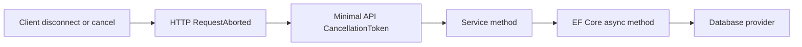

# CancellationTokenをdatabase処理まで伝播する

## 今回の課題

- 目安時間: 25〜35分
- 前提: `CancellationToken`、`async` / `await`、EF Coreのasync APIを説明できる
- 目的: HTTP requestの中断通知をendpointからservice、EF Coreまで途切れずに渡す理由と、その経路をtestで固定する方法を説明できる

capstoneのproduction codeには、すでにすべてのendpointからEF Coreのasync処理まで`CancellationToken`が渡されています。
今回は新しいruntime機能を増やすのではなく、その経路を監査し、将来tokenを渡し忘れたときに失敗するtestを追加しました。

clientがconnectionを切断したりrequestをcancelしたりすると、そのresponseを待つ相手はいなくなります。
serverがdatabase queryや保存処理をそのまま続けると、connection、CPU、database負荷などを不要に使います。
そこでASP.NET Coreの中断通知を下位layerまで伝え、処理が対応していれば早く終了できるようにします。

## endpointからEF Coreまでの経路

Minimal APIのendpoint parameterに`CancellationToken`を書くと、ASP.NET Coreは現在のHTTP requestに対応するcancel tokenを渡します。
このtokenは`HttpContext.RequestAborted`と結び付いています。

endpointはtokenをservice methodへ渡します。
serviceは同じtokenをEF Coreのasync methodへ渡します。
EF Core providerはcancel要求を観測すると、待機中のdatabase処理を中止できる範囲で中止し、通常は`OperationCanceledException`またはその派生型で完了します。



cancelは強制的にthreadを停止する命令ではありません。
各処理がtokenを受け取り、適切な地点で観測するcooperative cancellationです。
途中のlayerがtokenを渡さなければ、その先ではcancel要求を知ることができません。

## 現在のproduction codeの監査結果

各経路は次のようにつながっています。

| endpoint | service | tokenを受け取るEF Core API |
| --- | --- | --- |
| `GET /tasks` | `GetTasksAsync` | `CountAsync`, `ToListAsync` |
| `GET /tasks/{id}` | `GetTaskAsync` | `SingleOrDefaultAsync` |
| `POST /tasks` | `CreateTaskAsync` | `SaveChangesAsync` |
| `PUT /tasks/{id}` | `UpdateTaskAsync` | `SingleOrDefaultAsync`, `SaveChangesAsync` |
| `DELETE /tasks/{id}` | `DeleteTaskAsync` | `SingleOrDefaultAsync`, `SaveChangesAsync` |

例えば一覧取得では、同じtokenを二つのdatabase I/Oへ渡しています。

```csharp
var totalCount = await query.CountAsync(cancellationToken);

var items = await query
    .OrderBy(task => task.Id)
    .Skip((page - 1) * pageSize)
    .Take(pageSize)
    .Select(task => new TaskSummary(
        task.Id,
        task.Title,
        task.IsCompleted))
    .ToListAsync(cancellationToken);
```

`CountAsync`だけに渡しても、count完了後から一覧取得中に届いたcancel要求を`ToListAsync`は受け取れません。
一つのservice method内に複数のI/Oがある場合、cancel可能な各I/Oへtokenを渡します。

## tokenを受け取るだけでは不十分

次のmethod signatureだけでは、database処理のcancelは実現しません。

```csharp
public Task<TaskSummary?> GetTaskAsync(
    int id,
    CancellationToken cancellationToken)
```

methodがtokenを受け取っても、次の呼び出しで使わなければ経路はそこで切れます。

```csharp
// tokenを渡していない
.SingleOrDefaultAsync();
```

正しくは、I/O APIへ渡します。

```csharp
.SingleOrDefaultAsync(cancellationToken);
```

自前のloopなら`ThrowIfCancellationRequested`などで明示的に観測する場合もあります。
EF Coreのようにtoken parameterを持つasync APIでは、そのAPIへ渡すことで待機処理側に観測を任せます。

## cancel testが固定すること

testはserviceを呼ぶ前に`CancellationTokenSource.Cancel()`を実行し、すでにcancel済みのtokenを渡します。
この方法は実行時間やdatabase queryの速さに依存せず、tokenの渡し忘れを安定して検出できます。

query testでは`GetTasksAsync`が値を返さず、`OperationCanceledException`系で終了することを確認します。
もしserviceが`CountAsync`と`ToListAsync`へtokenを渡さなくなれば、queryは通常完了してtestが失敗します。

作成testでは、cancelされた`CreateTaskAsync`が例外で終了することに加え、別scopeから件数を読み直して初期dataの5件のままであることを確認します。
例外だけでは、clientへ結果を返さなかったことしか確認できません。
件数も確認することで、cancelされたINSERTがdatabaseへ残っていないことを外部から観測します。

このtestは、実際のnetwork切断タイミングや特定database providerが実行中SQLをどの瞬間に中止するかまでは保証しません。
保証するのは、serviceが受け取ったcancel状態をEF Core APIへ渡し、cancel済みのqueryとsaveを通常完了させないことです。

## Java / Springとの比較

Javaの`CompletableFuture.cancel`、thread interrupt、reactive streamのcancellationなどと目的は似ていますが、ASP.NET Coreではrequestに対応する`CancellationToken`をmethod parameterとして明示的に伝播する形が一般的です。

Spring MVCとJPAの同期処理では、client切断をapplication methodからrepositoryまで同じ形のtokenで渡す設計は一般的ではありません。
.NET codeを読むときは、`CancellationToken`を受け取っているかだけでなく、最終的なI/O APIまで同じtokenが渡っているかを追います。

## 新しく読むAPIと構文

### `CancellationTokenSource`

```csharp
using var cancellation = new CancellationTokenSource();
cancellation.Cancel();
```

`CancellationTokenSource`はcancel要求を発行する側です。
`Cancel()`を呼ぶと、対応する`Token`の`IsCancellationRequested`がtrueになります。
testではrequest timingに依存しないよう、service呼び出し前にcancelします。

### `ThrowsAnyAsync<OperationCanceledException>`

```csharp
await Assert.ThrowsAnyAsync<OperationCanceledException>(() =>
    service.GetTasksAsync(1, 20, cancellation.Token));
```

cancel処理は`OperationCanceledException`そのものか、`TaskCanceledException`などの派生型を返すことがあります。
`ThrowsAnyAsync<T>`は`T`またはその派生型を受け入れるため、cancelという契約を検証できます。

### 別scopeからのdatabase確認

```csharp
await using var verificationScope = factory.Services.CreateAsyncScope();
var dbContext = verificationScope.ServiceProvider
    .GetRequiredService<TaskDbContext>();
Assert.Equal(5, await dbContext.Tasks.CountAsync());
```

cancelされたcommandを実行したscopeはすでに破棄しています。
新しいscopeと`TaskDbContext`でdatabaseを読み直すことで、同じchange tracker内の状態ではなくdatabaseに残った状態を確認します。

## 変更対象ファイル

production codeは監査の結果、すでに全I/Oへtokenを渡していたため変更しません。

| ファイル | 変更内容 |
| --- | --- |
| `05-capstone/TaskManagementApi.Tests/CancellationTokenTests.cs` | queryとsaveがcancelを観測し、INSERTが残らないことを検証 |
| `05-capstone/docs/10-cancellation-token-propagation.md` | 現在の伝播経路とtestの意図を説明 |
| `05-capstone/docs/10-cancellation-token-propagation-answers.md` | 回答シートを追加 |

理解確認前なので、rootの`README.md`はまだ変更しません。

## 実装コード

### production codeの確認箇所

`05-capstone/TaskManagementApi/Program.cs`では、各endpointの`CancellationToken`を対応するservice methodへ渡しています。

```csharp
var result = await taskQueryService.GetTasksAsync(
    page,
    effectivePageSize,
    cancellationToken);
```

`TaskQueryService.cs`と`TaskCommandService.cs`では、そのtokenを各EF Core async APIへ渡しています。

```csharp
var totalCount = await query.CountAsync(cancellationToken);
var items = await query.ToListAsync(cancellationToken);
await dbContext.SaveChangesAsync(cancellationToken);
```

実際の一覧queryにはprojectionや並び替えが入りますが、ここではtokenを渡す位置だけを抜粋しています。

### `05-capstone/TaskManagementApi.Tests/CancellationTokenTests.cs`

```csharp
using var cancellation = new CancellationTokenSource();
cancellation.Cancel();

await Assert.ThrowsAnyAsync<OperationCanceledException>(() =>
    service.GetTasksAsync(1, 20, cancellation.Token));
```

query testは、cancel済みtokenで一覧取得が通常完了しないことを確認します。

```csharp
await Assert.ThrowsAnyAsync<OperationCanceledException>(() =>
    service.CreateTaskAsync("保存されないtask", cancellation.Token));
```

command testは、cancel済みtokenでINSERT保存が通常完了しないことを確認します。
その後、別scopeから件数を読み直して5件のままであることも検証します。

## 検証方法と結果

```fish
cd /home/yukihiro/Workspace/c#-learning/05-capstone
nix develop -c dotnet format TaskManagementApi.slnx --verify-no-changes --no-restore
nix develop -c dotnet test TaskManagementApi.slnx -m:1 --no-restore
```

既存test 18件とcancel test 2件を合わせ、`Passed: 20, Failed: 0, Skipped: 0`でした。

## コードリーディング課題

1. endpointとserviceが`CancellationToken`を受け取っていても、EF Coreのasync methodへ渡さなければdatabase待機を中断できないのはなぜですか。
2. 一覧取得で`CountAsync`と`ToListAsync`の両方へ同じtokenを渡す必要があるのはなぜですか。
3. cancelされた作成処理で例外だけでなく、別scopeからdatabase件数が5件のままであることも確認するのはなぜですか。

## 設問と教材の対応確認

| 設問 | 回答に必要な説明 |
| --- | --- |
| 問1 | 「tokenを受け取るだけでは不十分」の途中で伝播が切れる説明 |
| 問2 | 「現在のproduction codeの監査結果」の複数I/Oへ渡す説明 |
| 問3 | 「cancel testが固定すること」の例外とdatabase状態を分けて確認する説明 |

## 完了条件

- HTTP requestのcancel tokenがendpointへ渡されることを説明できる
- endpoint、service、EF Core APIへ同じtokenを伝播する必要性を説明できる
- cooperative cancellationでは各layerがtokenを観測する必要があると説明できる
- 一つの処理にある複数I/Oへtokenを渡す理由を説明できる
- cancel testが保証する範囲と、実networkやprovider timingまでは保証しないことを区別できる
- 全20件のtestが成功する
